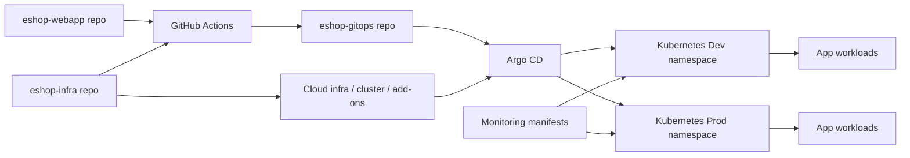

# Project Overview

This document covers the GitOps repository from a DevOps perspective.
It avoids sensitive values and keeps the guidance focused on structure, workflow, and recovery.

## Architecture Diagram

## Tech Stack

- Kubernetes
- Argo CD
- Kustomize
- GitHub Actions
- YAML manifests
- Prometheus
- Grafana

## Setup Steps

1. Clone the repository.
2. Review the `bootstrap` and `environments` folders.
3. Render manifests locally with `kustomize build` when you want to validate the output.
4. Check that Dev and Prod changes stay structurally aligned.

## How To Deploy Dev And Prod

### Dev

- The app repository opens a GitOps pull request against the Dev branch or Dev path.
- Argo CD syncs the Dev environment after the manifest change is merged.

### Prod

- The app repository should open a GitOps pull request for Prod.
- The Prod change should be reviewed and approved before merge.
- Argo CD syncs the Prod environment after the approved change lands.

## CI/CD Explanation

This repository is the deployment target for GitOps-based promotion.

- `bootstrap` registers the environments with Argo CD
- `environments/dev` carries the lower-risk live stack
- `environments/prod` carries the production stack
- Workflow changes in the app repo drive image promotion into GitOps
- Manifest validation workflows help catch structural errors before sync

## Monitoring Explanation

Monitoring resources are stored in the Dev and Prod environment folders.
They define the cluster monitoring stack as code so observability stays in Git.

This repo should document:

- Prometheus and Grafana placement
- Datasource and dashboard configuration
- Which environment gets which monitoring resources

## Security Considerations

- Do not commit secrets or private keys
- Keep ConfigMaps non-sensitive
- Protect Prod changes with review and approval
- Treat image tag updates as release changes
- Keep workflow credentials outside the repository

## Disaster Recovery Notes

- Roll back by reverting the Git commit that introduced the bad manifest
- Re-sync Argo CD to restore the previous desired state
- Recreate the environment by reapplying the GitOps manifests
- Keep backup and restore guidance in the app repo or infra docs when it is not GitOps-specific

## Repository Scope

This repository is the source of truth for:

- Argo CD bootstrap definitions
- Dev and Prod Kubernetes manifests
- Monitoring manifests
- Environment-specific rollout behavior
